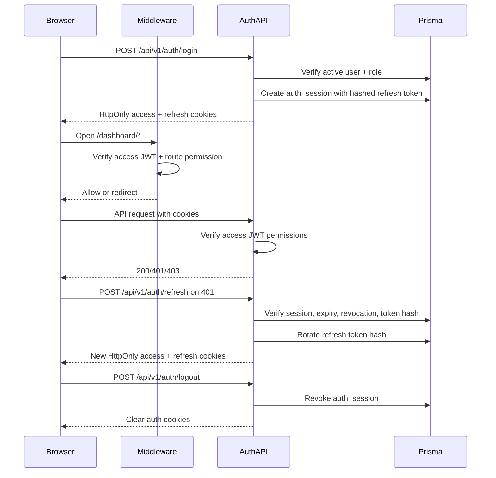

# Enterprise Authentication System

## 1. Authentication Flow Diagram



## 2. Login API

`POST /api/v1/auth/login`

- Validates email/password with Zod.
- Uses `bcrypt.compare` against the stored password hash.
- Requires an active, non-deleted user.
- Creates a database-backed `auth_session`.
- Sets short-lived access and rotating refresh tokens in `HttpOnly` cookies.

## 3. Register API

`POST /api/v1/auth/register`

- Validates a strong password: 12+ chars, uppercase, lowercase, number, symbol.
- Allows first-user bootstrap.
- Requires `users.create` permission once at least one user exists.
- Hashes the password with bcrypt cost `12`.
- Issues a new session after successful registration.

## 4. Refresh Token API

`POST /api/v1/auth/refresh`

- Reads only the `admin_refresh_token` cookie.
- Verifies the refresh JWT signature and expiry.
- Looks up `auth_session` by `sessionId`.
- Compares the presented refresh token with the stored HMAC-SHA256 hash.
- Rotates the refresh token and updates the stored hash on every refresh.
- Revokes the session if reuse or mismatch is detected.

## 5. Logout API

`POST /api/v1/auth/logout`

- Verifies the refresh cookie if present.
- Revokes the matching database session.
- Clears both access and refresh cookies.
- Returns `Cache-Control: no-store`.

## 6. Middleware Protection

`src/middleware.ts` protects dashboard routes.

- `/dashboard/*` requires a valid access JWT.
- Auth pages redirect to `/dashboard` when already signed in.
- Dashboard module paths enforce read permissions, for example `roles.read`, `users.read`, and `blogs.read`.
- API routes use route-level permission guards such as `requirePermission(request, "users.read")`.

## 7. Cookie Strategy

- Access cookie: `admin_access_token`, `HttpOnly`, `SameSite=Strict`, `Secure` in production/HTTPS, 15 minutes.
- Refresh cookie: `admin_refresh_token`, `HttpOnly`, `SameSite=Strict`, `Secure` in production/HTTPS, 7 days.
- Cookies are path-scoped to `/`.
- Tokens are never exposed to frontend JavaScript.
- Logout, reset password, and change password clear or revoke active sessions.

## 8. Prisma Auth Model

```prisma
model AuthSession {
  id               String    @id @db.VarChar(191)
  userId           Int
  refreshTokenHash String    @db.VarChar(255)
  userAgent        String?   @db.VarChar(500)
  ipAddress        String?   @db.VarChar(45)
  expiresAt        DateTime
  revokedAt        DateTime?
  createdAt        DateTime  @default(now())
  updatedAt        DateTime  @updatedAt

  user User @relation(fields: [userId], references: [id], onDelete: Cascade)
}
```

## 9. Frontend Auth Flow

- Login form posts to `/api/v1/auth/login`; cookies are set by the server.
- `useSessionState()` calls `/api/v1/auth/me` to hydrate the current user.
- `httpClient` sends credentials and refreshes once on protected `401` responses.
- Refresh failures leave the user unauthenticated and protected pages redirect through middleware.
- Password changes revoke sessions and force sign-in again.

## 10. RBAC Permission System

- Roles store permissions as JSON: `{ "users": ["create", "read"] }`.
- JWT access tokens include `role`, `permissions`, and `sessionId`.
- `can(session, "resource.action")` checks API and route permissions.
- `src/lib/rbac.ts` centralizes helpers for `hasRole`, `hasPermission`, `hasEveryPermission`, and `hasAnyPermission`.
- Seeded roles include Super Admin, Admin, Editor, and Manager.
